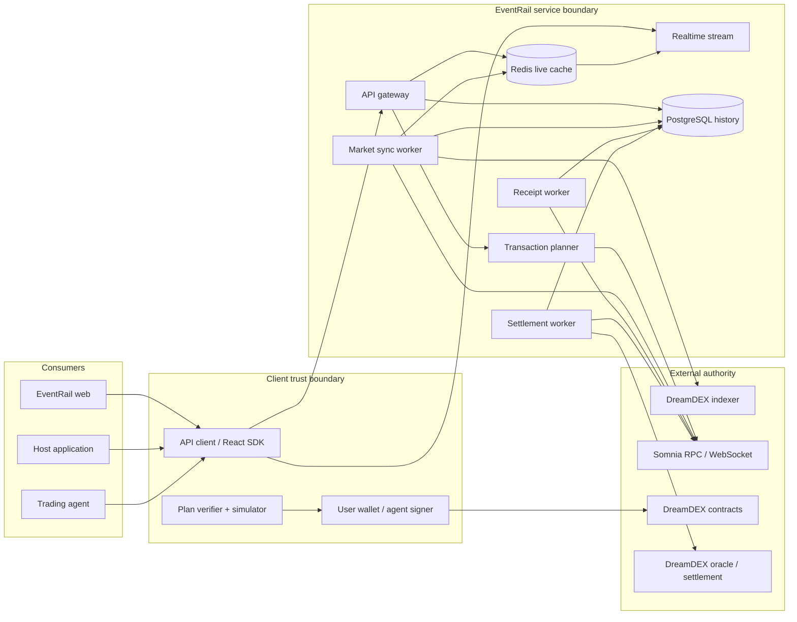
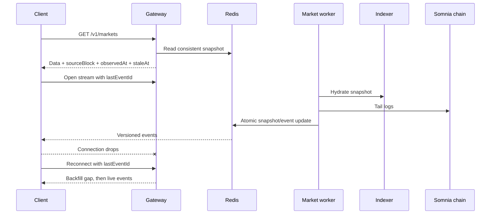
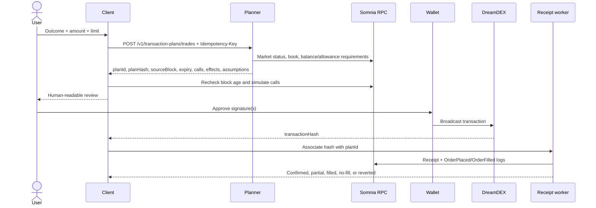
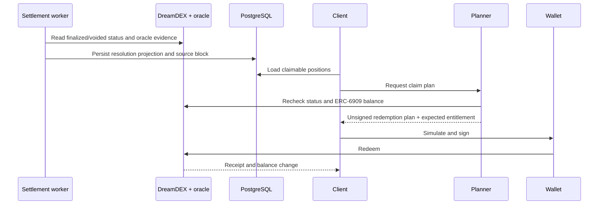
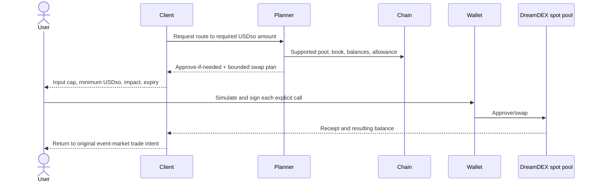

# ADR-0001: Non-custodial EventRail system boundaries

- Status: Accepted
- Date: 2026-09-09
- Decision owners: Product, platform, trading, and security
- Related issues: #1, #11

## Context

EventRail must support a first-party trading application, third-party embeds, React/headless SDK consumers, and agents without duplicating DreamDEX lifecycle logic or becoming a custodian. It needs fast reads and realtime updates while treating Somnia and DreamDEX contracts as the canonical authority for writes, fills, positions, and settlement.

The current official SDK surface is `@somnia-chain/markets-sdk` 0.29.x. It provides `SomniaMarkets`, normalized spot/binary/perpetual market reads, live watchers, React bindings, bigint-exact engine access, local or wallet signing, and Shannon/mainnet chain/address registries. Shannon is chain `50312`; mainnet is `5031`. EventRail wraps this surface behind its own versioned contracts rather than exposing SDK internals directly.

Primary protocol references:

- [Somnia Markets SDK package](https://www.npmjs.com/package/@somnia-chain/markets-sdk)
- [Somnia network information](https://docs.somnia.network/developer/network-info)
- [Official DreamDEX bot-kit architecture](https://github.com/somnia-chain/dreamdex-bot-kit/blob/main/docs/architecture.md)

## Decision

Use a non-custodial gateway architecture with three distinct planes:

1. **Read plane:** ingest, normalize, cache, and stream public DreamDEX/indexer/on-chain state.
2. **Planning plane:** create short-lived unsigned transaction plans after canonical preflight checks.
3. **Execution plane:** remain entirely in a user wallet or explicitly configured agent signer; EventRail observes the resulting public transaction and reconciles it.

No EventRail server accepts or stores an ordinary user's private key. The gateway is not a relayer in the MVP.

## System context



## Component responsibilities

| Component            | Owns                                                                                                 | Must not own                                               |
| -------------------- | ---------------------------------------------------------------------------------------------------- | ---------------------------------------------------------- |
| Web application      | Routes, user intent, wallet UX, client validation, simulation, signing request, recovery states      | Private keys, canonical market truth, server credentials   |
| API client           | Transport, version headers, retries for safe reads, typed errors, idempotency propagation            | Product UI, wallet signing, hidden caching                 |
| React SDK            | Headless hooks, live subscription lifecycle, loading/error/stale state                               | Host styling policy, private keys, transaction execution   |
| Gateway              | Authentication, quotas, validation, normalized reads, request IDs, freshness metadata                | Signing, custody, long-running indexing                    |
| Planner              | Canonical preflight, deterministic unsigned calls, effects/assumptions, expiry and plan hash         | Broadcasting, changing a returned plan, guaranteeing fills |
| Market sync worker   | Market discovery, stable identity, snapshots, phase/rollover state, cursor/checkpoint                | User requests, signing, portfolio ownership                |
| Receipt worker       | Transaction receipt, order ID, fill, revert, and confirmation convergence                            | Creating or resubmitting user transactions                 |
| Settlement worker    | Finalization/void detection, oracle evidence, claimable projections                                  | Deciding outcomes or redeeming for users                   |
| Redis                | Latest internally consistent market/book snapshot, stream fan-out, short-lived plans/idempotency     | Durable audit history, secrets, canonical truth            |
| PostgreSQL           | Durable markets, versions, checkpoints, transactions, fills, positions, settlements, projects, usage | Raw private keys, seed phrases, plaintext API keys         |
| DreamDEX adapter     | Translate official SDK/API/contract data into EventRail domain types                                 | Product policy, persistence, HTTP concerns                 |
| Somnia RPC/WebSocket | Canonical EVM reads, logs, simulations, broadcasts, receipts                                         | EventRail product identity or analytics                    |
| DreamDEX indexer     | Fast snapshots and queryable history                                                                 | Final write eligibility when it disagrees with chain       |

## Trust boundaries and signers

| Network write                    | Initiator                | Signer                                            | EventRail server authority              | Required client checks                                                                              |
| -------------------------------- | ------------------------ | ------------------------------------------------- | --------------------------------------- | --------------------------------------------------------------------------------------------------- |
| Approve USDso/outcome token      | User action              | Connected wallet                                  | Prepare only                            | chain, token, spender, exact/capped amount, expiry                                                  |
| Place IOC/limit order            | User or configured agent | Connected wallet/agent account                    | Prepare only                            | market phase, destination, side, price, quantity, deadline, spend, minimum result, source freshness |
| Cancel order                     | User or configured agent | Connected wallet/agent account                    | Prepare only                            | ownership, market, remaining quantity, destination                                                  |
| Mint/burn outcome shares         | User action              | Connected wallet                                  | Prepare only                            | collateral, market status, amount, minimum outputs                                                  |
| Redeem finalized/voided position | User action              | Connected wallet                                  | Prepare only                            | market identity, settlement state, outcome index, balance, expected entitlement                     |
| DreamDEX spot funding route      | User action              | Connected wallet                                  | Prepare route/calls only                | asset path, allowance, input cap, minimum receive, deadline                                         |
| Admin deployment/migration       | Authorized maintainer    | Dedicated deployment signer in CI/manual ceremony | Only for EventRail-owned infrastructure | protected environment approval and published addresses                                              |

EventRail API keys authorize API consumption, never a blockchain transaction.

## Data authority and consistency

The authority order is:

1. canonical Somnia state at a named block;
2. decoded contract logs and receipts;
3. DreamDEX indexer snapshot with its source block;
4. EventRail durable normalized projection;
5. EventRail Redis/live client cache.

Reads may use levels 3-5 for speed. Every response includes freshness metadata. Any operation that creates a transaction plan rechecks required invariants at levels 1-2. A disagreement does not get silently merged; the response becomes stale/degraded and the write is withheld.

Market state is keyed by DreamDEX `marketId` plus network. Pool addresses are versioned attributes because binary market pools may be recycled across windows. Historical orders, fills, positions, and settlements retain the original market identity.

## Principal sequences

### Read and realtime recovery



### Trade plan and execution



The plan is immutable after hashing. Client changes require a new plan. IOC completion with zero fills is a valid confirmed outcome, not a missing receipt.

### Market rollover

```mermaid
sequenceDiagram
    participant Worker as Market worker
    participant SDK as DreamDEX SDK/indexer
    participant DB as PostgreSQL
    participant Stream
    participant Client

    Worker->>SDK: Discover markets and on-chain phase
    SDK-->>Worker: New window/pool attributes
    Worker->>DB: Match stable identity and create successor edge
    Worker->>DB: Preserve original market/orders/positions
    Worker->>Stream: market.rollover_detected
    Stream-->>Client: Original + successor marketIds
    Client-->>Client: Lock old trade form; offer successor navigation
```

### Settlement and claim



### USDso funding



## Technology choices

| Concern              | Choice                                     | Reason                                                                                                                      |
| -------------------- | ------------------------------------------ | --------------------------------------------------------------------------------------------------------------------------- |
| Workspace            | pnpm + Turborepo                           | Explicit package graph, deterministic lockfile, cached cross-workspace tasks                                                |
| Web surfaces         | Next.js App Router + React                 | Route-native loading/error boundaries, server/client composition, deployable consumer and developer apps                    |
| Gateway              | Fastify + Zod                              | Low overhead, schema-first validation, structured logging with redaction                                                    |
| Protocol integration | `@somnia-chain/markets-sdk` + viem         | Official typed DreamDEX surface, built-in Shannon chains/addresses, bigint correctness, wallet/local account support        |
| Durable storage      | PostgreSQL                                 | Relational lifecycle/audit queries, transactions, constraints, mature operations                                            |
| Live cache/fan-out   | Redis                                      | Atomic latest snapshots, TTL plans/idempotency, stream/pub-sub primitives                                                   |
| Public contracts     | OpenAPI 3.1 + Zod/TypeScript               | Machine-readable REST contract with executable runtime validation                                                           |
| Client delivery      | REST + SSE initially                       | Simple browser/proxy behavior and resumable one-way market events; WebSocket remains inside protocol adapter where required |
| Observability        | OpenTelemetry-compatible structured events | Cross-request/worker correlation without coupling the SDK to one vendor                                                     |

## Rejected alternatives

- **Server-held user keys:** rejected because it creates custody, breach concentration, and ambiguous authority.
- **Server relayer as the default path:** deferred because sponsorship/account abstraction changes failure and abuse models; direct wallet signing is sufficient for MVP.
- **Browser-only protocol integration:** rejected because every host would duplicate normalization, reconciliation, history, quotas, and lifecycle behavior.
- **Gateway as canonical state:** rejected; it is a projection and planner over DreamDEX/Somnia authority.
- **Polling-only realtime:** rejected because it increases latency/load and cannot guarantee gap recovery without explicit cursors.
- **WebSocket for the public MVP API:** deferred in favor of resumable SSE for one-way events; protocol-facing WebSockets remain in the adapter/workers.
- **Pool address as identity:** rejected because address reuse/rollover can attach old state to a new event window.
- **Float-based financial math:** rejected; protocol quantities remain bigint/decimal-string until display boundaries.
- **A single combined web/API process:** rejected because consumer rendering, request serving, and long-running chain workers scale and fail differently.

## Consequences

Benefits:

- a compromised gateway cannot sign user transactions;
- all consumers share one lifecycle and safety contract;
- reads stay fast while plans retain canonical preflight;
- workers can recover independently from checkpoints; and
- SDK/API versions can remain stable across DreamDEX upgrades.

Costs:

- projections introduce explicit freshness and reconciliation work;
- client verification must be maintained alongside server planning;
- transaction journeys span wallet, chain, and asynchronous workers; and
- Redis/PostgreSQL add operational complexity before large scale.

These costs are accepted because they directly serve EventRail's adoption and trust thesis.
