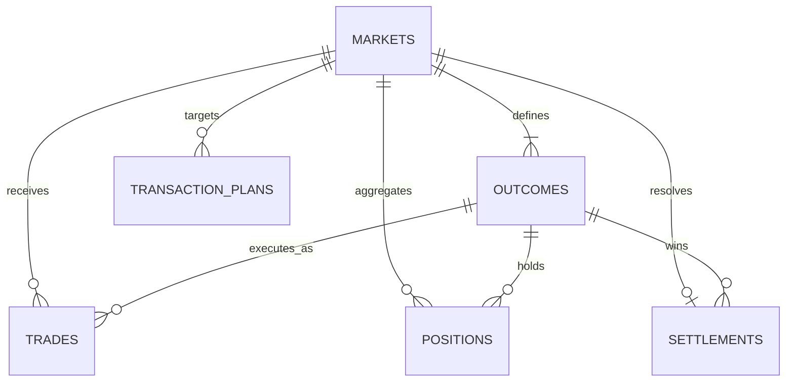

# EventRail durable data model

The schema separates DreamDEX source identity from EventRail's internal UUIDs, preserves exact on-chain values with `numeric`, and makes replayed chain events idempotent through transaction-hash/log-index constraints.

## Data dictionary

| Table                 | Purpose                                           | Identity and precision                                                                |
| --------------------- | ------------------------------------------------- | ------------------------------------------------------------------------------------- |
| `integrators`         | API/SDK consumers and future webhook ownership    | Stable unique slug and UUID                                                           |
| `markets`             | Canonical DreamDEX event-contract market snapshot | Unique network/external ID and slug; prices `numeric(20,18)`; totals `numeric(38,18)` |
| `outcomes`            | Tradable market outcomes                          | Unique external ID and side per market                                                |
| `trades`              | Immutable normalized fills                        | Unique network/transaction hash/log index; amounts `numeric(78,18)`                   |
| `positions`           | Rebuildable per-wallet position projection        | Unique network/wallet/market/outcome                                                  |
| `settlements`         | Final or voided resolution state                  | One settlement per market                                                             |
| `transaction_plans`   | Short-lived non-custodial execution plans         | UUID plus unique plan hash and explicit expiry                                        |
| `idempotency_keys`    | Safe API write retries                            | Composite scope/key with request hash and expiry                                      |
| `indexer_checkpoints` | Per-worker chain cursor                           | One numeric block height per worker/network                                           |
| `chain_events`        | Replay and audit envelope for observed logs       | Unique network/transaction hash/log index; JSON payload                               |
| `schema_migrations`   | Applied migration ledger                          | Version and immutable SHA-256 checksum                                                |

PostgreSQL `numeric(78,0)` is used for chain integers that may exceed JavaScript's safe integer range. API serializers must return those values as strings. Addresses and hashes remain normalized text with structural checks so leading zeroes are preserved.

## Index and retention policy

- Market discovery indexes cover network, phase, closing time, category, and volume.
- Trade history indexes support market and wallet timelines without scanning raw chain events.
- Expiry indexes let a scheduled worker delete expired plans and idempotency records efficiently.
- `chain_events` is the durable replay/audit log. Keep 90 days online, then archive by month before deletion. The `observed_at` index supports bounded retention jobs.
- Aggregated `markets`, `positions`, `settlements`, and `trades` have no automatic expiry.
- Redis contains disposable derived state only; PostgreSQL remains the recovery source of truth.

Every migration must include a matching rollback file. CI applies all migrations, rolls the latest migration back, and reapplies it against a clean PostgreSQL service.
