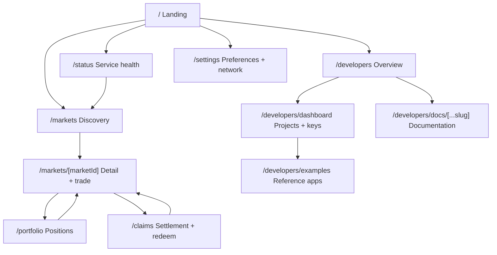
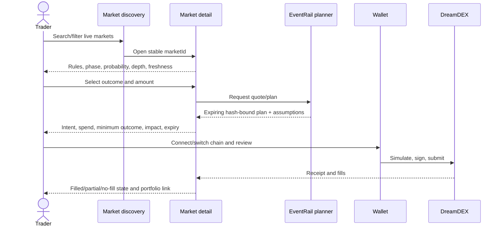
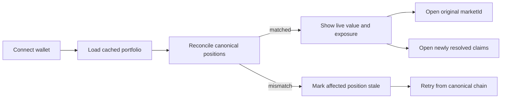
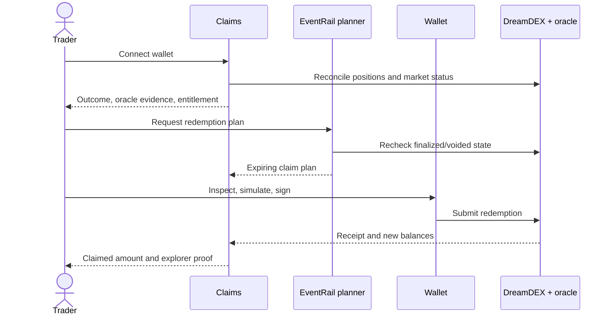
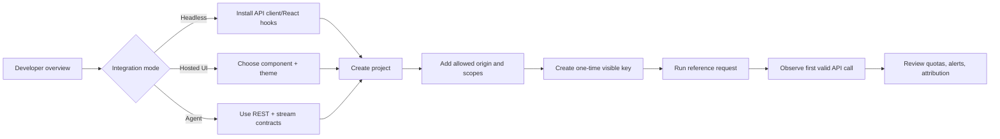

# EventRail sitemap and user flows

Status: Accepted for M0  
Owners: Product design and frontend  
Related issues: #1, #13

## Route map

Desktop uses a persistent header for Markets, Portfolio, Claims, and Developers, with Settings and Status in the utility/footer navigation. Mobile uses persistent bottom access to Markets, Portfolio, and Claims plus a menu for Developers, Settings, and Status. Contextual links connect positions and claims back to their market.

## Page contract

| Route                        | Purpose                                                   | Primary action          | Secondary paths                                       | Required states                                                                                                                                         |
| ---------------------------- | --------------------------------------------------------- | ----------------------- | ----------------------------------------------------- | ------------------------------------------------------------------------------------------------------------------------------------------------------- |
| `/`                          | Explain the product and surface active opportunities      | Explore markets         | Start building, open featured market                  | loading highlights, empty market set, degraded live data                                                                                                |
| `/markets`                   | Search, filter, compare, and discover markets             | Open a market           | Change category/sort, retry stream                    | skeleton grid, zero results, stale, stream reconnect, fatal load error                                                                                  |
| `/markets/[marketId]`        | Understand rules, probability, depth, and trade intent    | Review trade plan       | Inspect oracle/rules, fund USDso, open related market | loading, unavailable, paused, rolling, resolving, resolved, voided, disconnected wallet, wrong chain, insufficient funds, stale quote, simulation error |
| `/portfolio`                 | Reconcile open positions, exposure, and performance       | Open position           | Filter, retry reconciliation, go to claims            | disconnected, empty, loading, partial data, stale valuation, reconciliation mismatch                                                                    |
| `/claims`                    | Explain resolutions and redeem claimable positions        | Review claim plan       | View oracle evidence, open market                     | disconnected, empty, resolving, claimable, voided, already claimed, failed simulation                                                                   |
| `/developers`                | Explain API/SDK value and guide selection                 | Start quickstart        | View API, SDK, examples                               | docs loading, version unavailable, service degradation                                                                                                  |
| `/developers/dashboard`      | Manage projects, keys, origins, usage, webhooks           | Create project          | Rotate/revoke key, inspect request                    | signed out, empty, quota warning, validation error, destructive confirmation                                                                            |
| `/developers/docs/[...slug]` | Versioned integration reference                           | Copy/run example        | Switch version, report problem                        | navigation loading, unsupported version, missing page                                                                                                   |
| `/developers/examples`       | Prove wallet, streamer, community, and agent integrations | Run example             | View source                                           | environment missing, wallet disconnected, API unavailable                                                                                               |
| `/settings`                  | Configure display, network, safety, privacy, and motion   | Save preferences        | Reset defaults                                        | loading, validation error, saved, storage unavailable                                                                                                   |
| `/status`                    | Show current and historical component health              | Subscribe/view incident | Return to markets                                     | operational, degraded, outage, maintenance, telemetry unavailable                                                                                       |

## State language

- **Loading:** preserve layout with labelled skeletons; never show zero as loaded data.
- **Empty:** explain why the set is empty and provide one next action.
- **Stale:** retain last-known data with source block/time, disable unsafe actions, and offer refresh.
- **Recovering:** show reconnect/backfill progress and keep the last internally consistent snapshot.
- **Locked:** explain phase, chain, balance, allowance, or policy preventing the action.
- **Error:** use a stable error code, plain-language effect, recovery action, and request ID.
- **Disconnected:** permit public reads; request a wallet only at a wallet-specific action.
- **Success:** connect confirmation to the resulting fill, position, claim, or project rather than ending at a toast.

## First-trade flow

Recovery branches:

- stale or expired plan -> refresh canonical state and request a new plan;
- wrong network -> request explicit wallet switch, then revalidate the plan;
- insufficient USDso -> present the funding route without auto-executing it;
- simulation revert -> map the revert to a stable error and keep form inputs;
- wallet rejection -> return to review without treating it as an application failure;
- confirmed IOC with no fill -> show returned funds and current market price.

## Returning-trader flow

The portfolio never migrates a historical position to a successor pool during rollover. It links the original market to the current successor as a separate discovery action.

## Claim flow

## Integrator onboarding flow

API keys are shown once, stored hashed, scoped per environment, and never included in client-side examples unless explicitly safe for a public origin-restricted mode.
